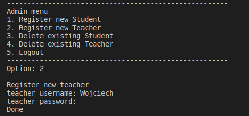

# College management system

Create a console-based basic college system using Python and use MySQL as a database.
As an additional feature - encrypt password using **bcrypt** Python package.

## Setup
1. Install Python 3.6 and MySQL. 
2. Install package requirements. 
3. Run main script:
```bash
cd scripts
python3 college_system.py
```

## Console view

### Admin panel
Example of adding new teacher to database.



Example of deleting non-existing student. 


### User panel
Example of login authentication. 


